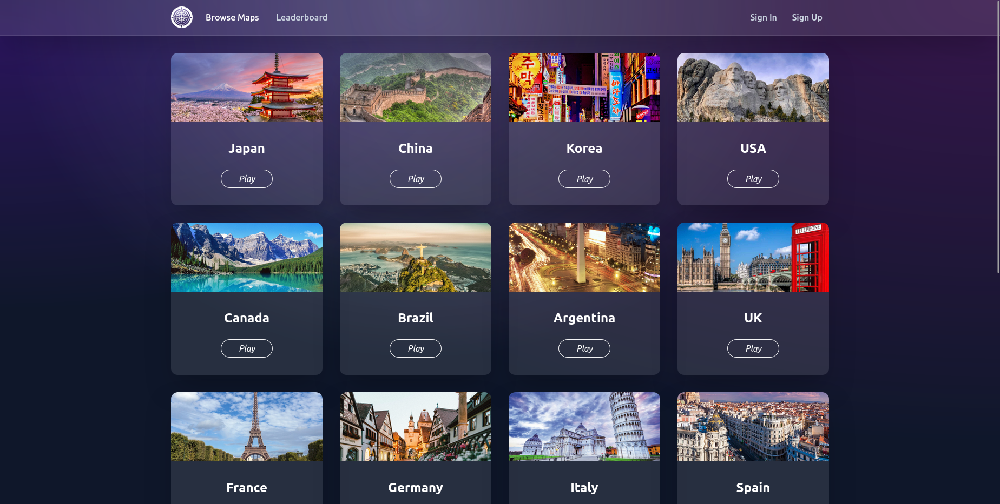
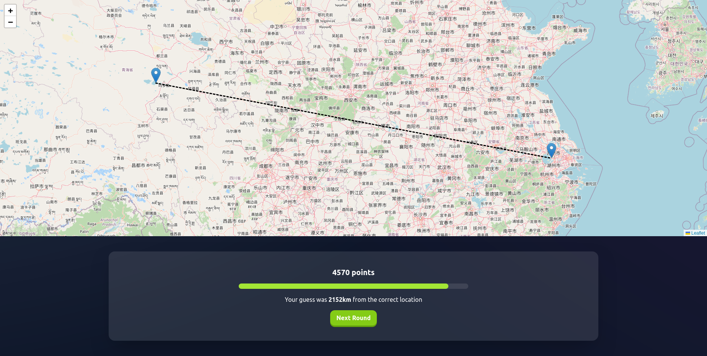
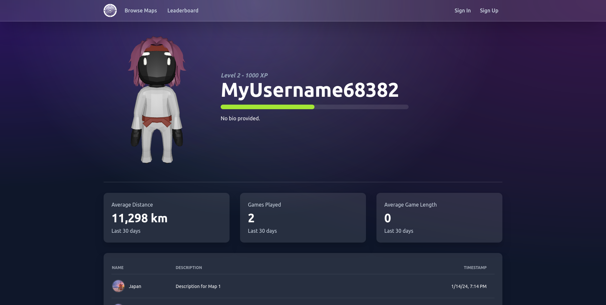
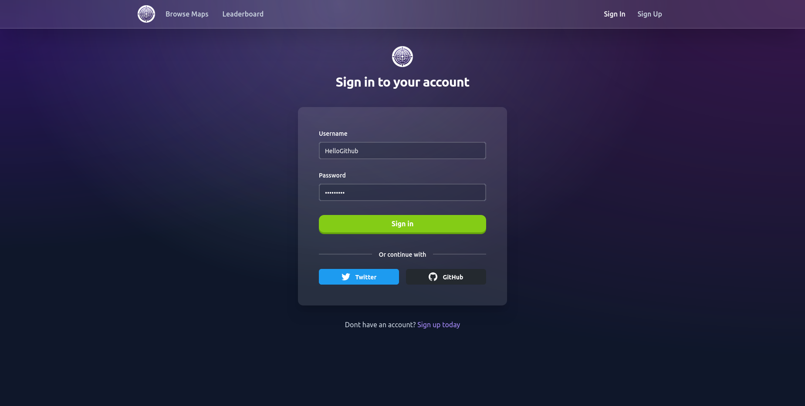
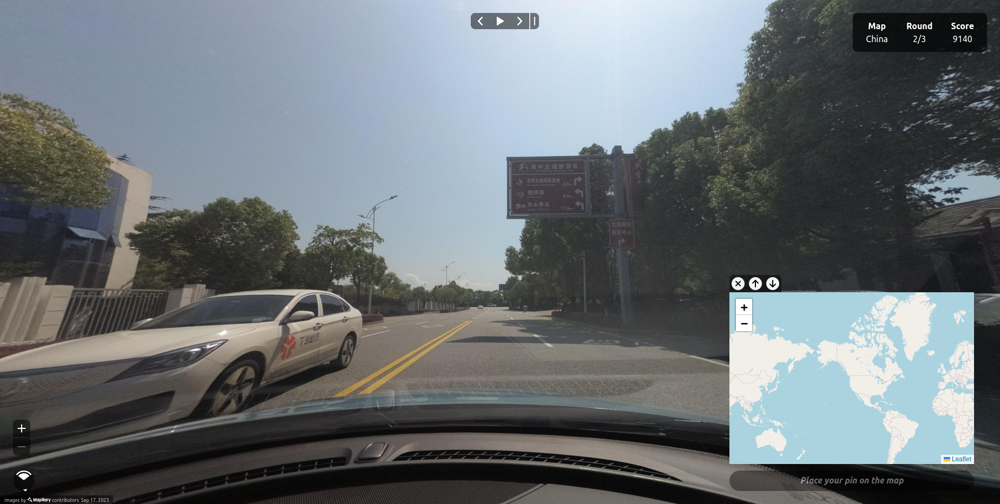

<h1 align="center">EarthTraverse</h1>

<h3 align="center">
  <a href="https://www.earthtraverse.app/">Visit the live app</a> |
  <a href="https://github.com/JarrodMalkovic/earth-traverse/issues">Report Bug</a> |
  <a href="https://github.com/JarrodMalkovic/earth-traverse/issues">Request Feature</a> 
</h3>


## 📝 Table of contents

- [Run Locally](#-run-locally)
- [Screenshots](#-screenshots)
- [Technologies](#-technologies)
- [License](#-license)

## 🚀 Run Locally

### Clone repo to your local machine


```bash
git clone git@github.com:JarrodMalkovic/earth-traverse.git
```

### Run docker composer

```bash
docker compose up --build
```

### Run in browser

Open `https://localhost:4200` in your browser.


## 📸 Screenshots







## 💻 Technologies

This project is is created with:
- TypeScript, Angular, TailwindCSS, Java, Spring Boot, PostgreSQL and deployed to Vercel and Heroku

## ⚖️ License

This project is licensed under the MIT License

<hr>

<h3>
  <a href="https://www.jarrodmalkovic.com/">Visit the live app</a> |
  <a href="https://github.com/JarrodMalkovic/earth-traverse/issues">Report Bug</a> |
  <a href="https://github.com/JarrodMalkovic/earth-traverse/issues">Request Feature</a>
</h3>